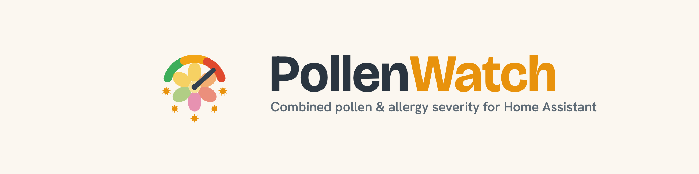
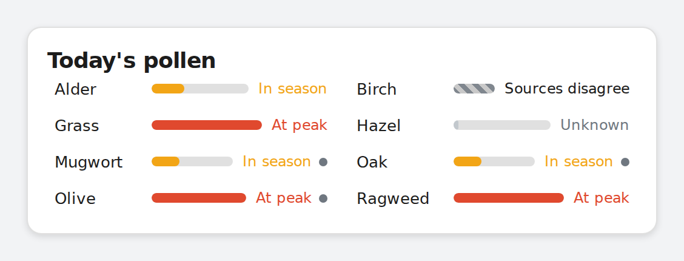
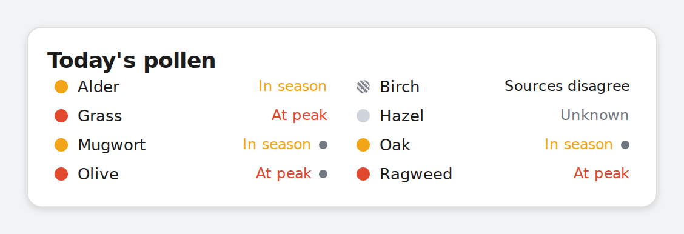
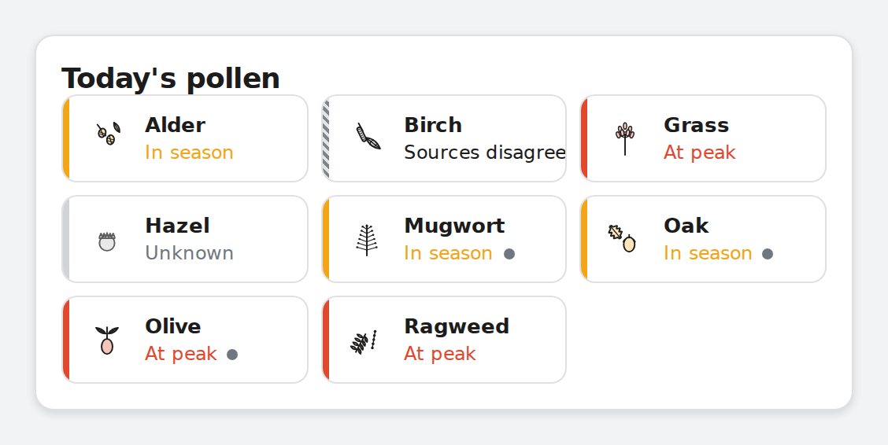
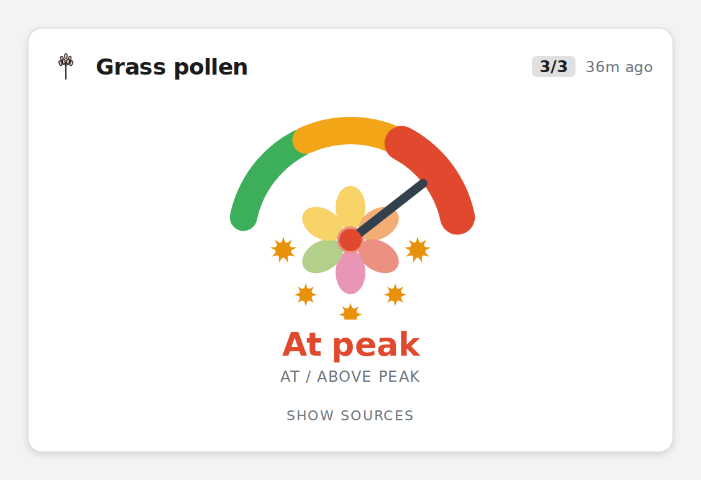
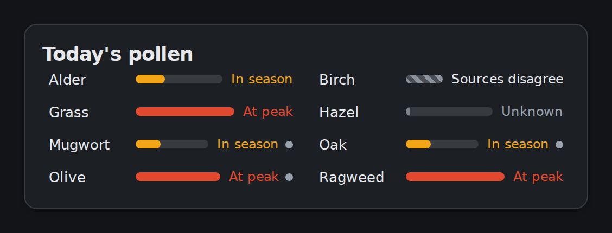
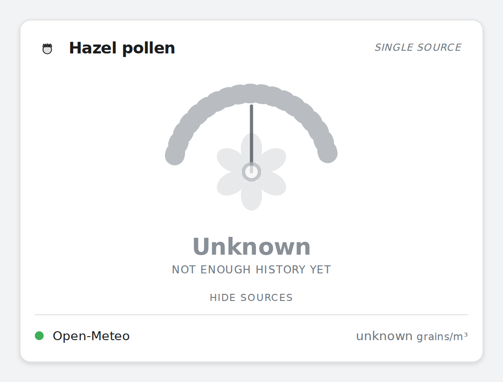
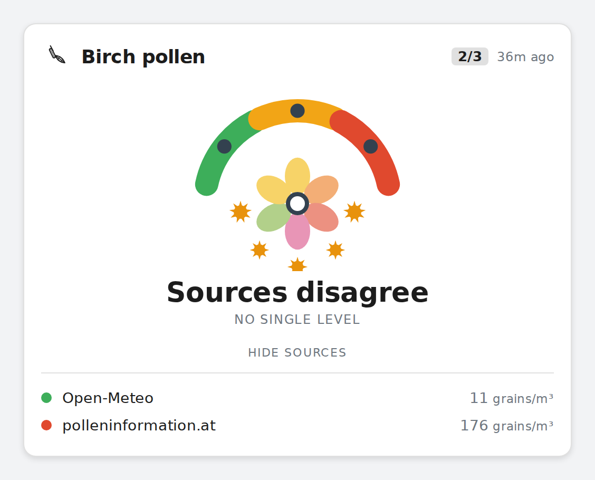

# PollenWatch

[](https://github.com/TheDave94/pollenwatch/releases)
[](https://github.com/TheDave94/pollenwatch/actions/workflows/validate.yml)
[](https://github.com/TheDave94/pollenwatch/actions/workflows/lint.yml)
[](https://hacs.xyz/)
[](LICENSE)



A multi-source European pollen aggregator for Home Assistant. The Home Assistant
ecosystem already has ~10 pollen integrations that each wrap a *single*
provider; PollenWatch instead **combines independent sources** and adds a
**cross-source analytics layer** on top. That combination is the point.

> [!NOTE]
> **PollenWatch is a personal project shared publicly.** Stable means the
> maintainer relies on it daily. It ships a bundled Lovelace severity-gauge
> card that is auto-registered on install — one HACS install delivers both.
> PollenWatch tracks **24 canonical species across trees, grasses, herbs and one
> spore**; you pick which ones to materialize as entities at setup (preselected
> from your country) and can change the selection any time in **Options**. See
> **[Known limitations](#known-limitations)** below for honest disclosure of the
> open items.
>
> Minimum Home Assistant **2024.11.0** (see
> [HA_COMPATIBILITY.md](HA_COMPATIBILITY.md) for the API audit).

> [!IMPORTANT]
> **Upgrading from PollenWatch 1.x or 2.x is a breaking change.** Version 3.0
> reset the config-entry schema and removed the old automatic migration, so an
> existing pre-3.0 entry will **not** load on 3.0+. After updating, delete the
> PollenWatch integration entry and add it again to reconfigure: re-selecting the
> same species and sources reclaims the same `entity_id`s (existing dashboards
> keep working), but you will need to re-enter any source API keys
> (polleninformation, Google) and per-species sensitivity settings. **Fresh
> installs are unaffected.**

## Sources

Each source is optional except Open-Meteo, and **what you get depends on your
location**: outside Germany you get no DWD; outside Switzerland no MeteoSwiss;
outside Bavaria no ePIN; outside the 13 polleninformation countries you get only
Open-Meteo (all of Europe) and Google (global, if enabled).

| Source | Coverage | API key | Notes |
| --- | --- | --- | --- |
| **Open-Meteo (CAMS)** | All of Europe | none | **Always-on primary.** 6 species, hourly, 5-day **forecast**, 92-day backfill. |
| **polleninformation.at** | 13 countries¹ | **free key required** | Optional. Daily 0–4 index **forecast**; more species, country-dependent. |
| **DWD Pollenflug** | **Germany only** | none | Optional. Daily 7-point regional index **forecast**; you pick your DWD region. |
| **MeteoSwiss** | **Switzerland only** | none | Optional, **observation-only**. Hourly grains/m³; nearest of 19 automatic stations auto-picked. Covers alder/birch/grass. |
| **ePIN (Bavaria)** | **Bavaria only** | none | Optional, **observation-only**. 3-hourly grains/m³; nearest of 8 automatic stations auto-picked. No olive. |
| **Google Pollen** | **Global** | **billing-gated key**² | Optional, **consensus-only**³. UPI 0–5 index, 5-day **forecast**, all 6 allergens (**only source with olive**). |

¹ AT, CH, DE, ES, FR, GB, IT, LV, LT, PL, SE, TR, UA.
² Requires a Google Cloud project with the Pollen API enabled **and a billing
account** (free tier ~5,000 req/month, but a payment method must be on file) —
more involved than the other sources' free keys.
³ **Consensus-only:** Google's Maps Platform terms forbid caching/storing
forecast results, so Google feeds consensus/divergence and gets a raw sensor +
forecast + personal_score, but is **never** baselined into recent_percentile.

**Forecast vs observation:** Open-Meteo, polleninformation, DWD and Google
provide a *forward forecast* (today + coming days). MeteoSwiss and ePIN are
*observation networks* — they report measured concentrations up to the latest
reading, with **no tomorrow value**, so their sensors show the current/most-recent
reading and today's running peak rather than a multi-day outlook.

PollenWatch tracks **24 canonical species** spanning trees, grasses, herbs and
one spore — covering everything any of the six sources can publish, plus the
EAACI/D'Amato high- and moderate-potency set. Open-Meteo is the largest-coverage
source (the CAMS-canonical 6); polleninformation, DWD, ePIN, MeteoSwiss and
Google each add their own subset (e.g. ash, oak, hazel, rye, plane_tree, cypress,
plantago, alternaria). At setup you choose which species to materialize as
entities; the per-country preselection seeds a defensible starting set.
A source only produces sensors for species it actually reports at your location.
See [Entities](#entities) for the honest data-availability picture.

## Analytics

On top of the raw per-source sensors:

- **recent_percentile** — today's level versus the recent window (per source).
  Open-Meteo (92-day backfill) and MeteoSwiss (months of recent hourly data)
  compute it on day one from their own history; polleninformation, DWD and ePIN
  baseline on Home Assistant recorder history and honestly report "insufficient
  history" until ~2 weeks accrue (and "off_season" when the whole window is
  zero). **Google is excluded** — its licence forbids storing forecasts, so it
  gets no percentile (it still feeds consensus and gets a raw sensor).
- **personal_score** — a source's raw value × your per-species sensitivity
  multiplier (0.0–2.0), for personal-threshold automations.
- **consensus + divergence** *(cross-source)* — sources are compared on a common
  **3-level scale derived from the EAACI / Copernicus CAMS thresholds** (each
  source's native scale is bucketed or collapsed onto it — see
  [ANALYTICS.md](ANALYTICS.md), where every threshold is sourced, not invented).
  **consensus** is categorical — `none` / `low` / `high` / `mixed` — and carries
  `source_count` + `max_possible_sources` so the card can render the `n/m`
  authority badge. A single-source species (`1/m`) gets a consensus reading
  pass-through (no `mixed` is ever emitted) plus the card's visual humbling.
  **divergence** is a binary flag, only emitted when ≥2 sources actually
  disagree by more than one level. Note the
  [#1](https://github.com/TheDave94/pollenwatch/issues/1) lone-higher edge
  above (reachable when 3+ sources cover a species).

## Installation

PollenWatch is not in the default HACS store yet. Add it as a custom repository:

1. In Home Assistant, open **HACS → Integrations → ⋮ → Custom repositories**.
2. Add `https://github.com/TheDave94/pollenwatch` with category **Integration**.
3. Install **PollenWatch**, then restart Home Assistant (minimum HA 2024.11.0).
4. Go to **Settings → Devices & Services → Add Integration** and search for
   **PollenWatch**.

## Setup & configuration

Setup is a two-step wizard with Open-Meteo on by default.

**Step 1 — Location.** Pick the point to monitor on the map (defaults to your
Home Assistant location). Open-Meteo snaps it to the nearest ~10 km CAMS grid
cell; setup is refused if the location is outside CAMS European coverage.
**Location is fixed once set** (to keep recorder history and the percentile
baseline coherent). To move it, remove and re-add the integration. You can
add PollenWatch more than once for several locations.

**Step 2 — Species.** A checkbox list of all 24 species, **preselected from
your Home Assistant country** via the region-defaults table (e.g. AT/DE/CH
get the Central-European set + ash/oak; IT/ES add olive/cypress/nettle_family;
SE skips Mediterranean species; UK gets plane_tree). The maintainer's
recommendation is the starting point — uncheck what you don't want, check
extras that matter to you. `alternaria` (a fungal spore, not pollen) is the
single deliberate opt-in: never preselected, available if you want it.

In the integration's **Options** (after setup) you can change the selection
and update interval, set **personal sensitivity** multipliers per species, and
enable the optional sources:

- **polleninformation.at** — toggle on, pick your country, and paste a free API
  key (requested from polleninformation.at). Stored encrypted in HA.
- **DWD** — toggle on and pick your DWD region (Germany only; enabling it for a
  non-German location is rejected as out-of-coverage).
- **MeteoSwiss** (Switzerland) and **ePIN** (Bavaria) — just toggle on; no key,
  no region. The nearest measuring station to your location is picked
  automatically (shown in the option description and as a `station` attribute on
  the sensors). Enabling either outside its country/region is rejected as
  out-of-coverage.
- **Google Pollen** (global) — toggle on and paste an API key. **Read the option
  text first:** this needs a Google Cloud project with the Pollen API enabled
  **and a billing account attached** (there is a free tier, but Google requires a
  payment method on file) — it is more involved than the other keys. Stored
  encrypted in HA. Google is consensus-only (no recent_percentile).

Changing the selection later prunes any deselected species cleanly — the
entities and their device are removed from the registry, not left as
permanently-`unavailable` orphans.

## Entities

Raw sensors live under a per-source device (e.g. "PollenWatch Open-Meteo",
"PollenWatch MeteoSwiss", "PollenWatch ePIN"):
`sensor.pollenwatch_<source>_<species>` (state = that source's current value;
attributes include a daily-peak forecast and provenance — and, for the
station-based sources, the picked `station`). Source-specific derived sensors
sit alongside them: `..._<species>_recent_percentile` and
`..._<species>_personal_score`.

The cross-source metrics live under a separate **"PollenWatch Analytics"**
device: `sensor.pollenwatch_analytics_<species>_consensus` (categorical
none/low/high/mixed; carries `source_count` + `max_possible_sources` so the
card can render the `n/m` badge) and
`binary_sensor.pollenwatch_analytics_<species>_divergence` (binary flag, only
emitted when ≥2 sources actually disagree).

### How many entities will I see?

The entity-count table below is a **ceiling, not a promise** — it's the count
you'd get if every source you enable also covered every species you select.
Real installations almost always fall under it because of the data-availability
matrix.

The formula has two parts:
- **Per-source entities** = species × (3 if the source has recent_percentile, 2 if not). The five non-Google sources have percentile; Google omits it (its licence forbids storing forecasts).
- **Analytics entities** = species × (2 if covered by ≥2 enabled sources: consensus + divergence; 1 if covered by 1: consensus only).

| Selected species × sources enabled | Per-source ceiling | Analytics ceiling | Total ceiling |
|---|---|---|---|
| **6 species, 1 source** (Open-Meteo only) | 6 × 3 = 18 | 6 × 1 = 6 | **≤ 24** |
| **6 species, 2 sources** (Open-Meteo + DWD) | 6 × 3 × 2 = 36 | 6 × 2 = 12 | **≤ 48** |
| **8 species, 4 sources** (AT default + DWD + ePIN, no Google) | 8 × 3 × 4 = 96 | 8 × 2 = 16 | **≤ 112** |
| **+ adding Google** to any of the above | + species × 2 | unchanged | + species × 2 |

A real install almost always lands well under the ceiling: actual coverage is
sparse (e.g. ePIN measures plantago + urtica but not olive; DWD has no olive;
MeteoSwiss only covers alder/birch/grass + beech).

**The honest data-availability picture (one paragraph):** not every species is
reported by every source — the matrix is asymmetric by design (DWD covers
Germany-relevant species, ePIN covers Bavaria-specific species like plantago
and urtica, MeteoSwiss measures only alder/birch/grass and beech, Google adds
olive globally). A species you've selected that **no enabled source covers at
your location simply does not materialize an entity** — selection bounds the
blowup; you don't get permanently-`unavailable` orphans. A species **one source
covers** still gets a consensus entity (badge reads `1/n`, with the gauge in
single-source mode — desaturated, with an explicit "single source" label, so the
honesty gradient is visible at a glance). The 3-level scale itself
(`none`/`low`/`high`) and its grains/m³ boundaries are sourced from
EAACI/Pfaar position papers and used by CAMS/Climate-ADAPT (see
[ANALYTICS.md](ANALYTICS.md)). Every raw and consensus sensor carries a
`threshold_status` attribute classifying the species into one of 5 evidence
tiers — `species_specific` (peer-reviewed per-species cutoff exists; 13 species),
`family_eaaci` (EAACI's actual family group, no species refinement; 5 species),
`established_no_threshold` (characterised allergen but no published numeric
cutoff, working bracket carried; 3 species), `family_analogy` (analogy-only,
weakest; 2 species), and `fungal` (Alternaria, separate evidence base). Six
numeric brackets use refined per-species values (ragweed 5/20, olive 10/200,
birch 20/100, alder 45/80, hazel 35/80, mugwort 3/50) — cited basis per species
in [ANALYTICS.md](ANALYTICS.md).

## Dashboard card

A bundled Lovelace card ships with the integration and is auto-registered as a
resource on install — no manual resource step. It offers **four layouts** —
pick one in **Options → Default card layout**, and every card on every
dashboard follows it. Per-card YAML overrides are supported for power users.

> Using the [Oriel dashboard strategy](https://github.com/TheDave94/oriel-dashboard)?
> It **auto-detects PollenWatch** and renders a first-party pollen card + badges
> automatically — no card configuration needed.

| Layout | What it shows | Best for |
| --- | --- | --- |
| **gauge** | One species, full categorical gauge + per-source breakdown on click | Single-allergy "is it bad right now?" view |
| **bars** | One row per species, severity-tinted fill bar + level word | Flagship multi-species overview — your whole allergy picture in one card |
| **compact** | Dense dot-grid, multi-column | Many species (8+); maximum density |
| **tiles** | Severity-tinted icon + name + level, tile grid | Visual scan; mirrors a tile-style dashboard aesthetic |

The same data in each layout:

| Bars — flagship multi-species overview | Compact — dense dot-grid |
|---|---|
|  |  |
| Tiles — severity-tinted icon grid | Gauge — single species + per-source breakdown |
|  |  |

Light and dark themes are both supported:



### Minimal YAML

If you've set the default layout in Options, the card needs **no config at all**
— it picks up your layout choice and your selected species automatically:

```yaml
type: custom:pollenwatch-card
```

### Per-card YAML

To pick a different layout for one card, or to customise:

```yaml
# Single-species gauge (original view)
type: custom:pollenwatch-card
species: grass            # required for gauge — any canonical species key

# Multi-species overview (bars / compact / tiles)
type: custom:pollenwatch-card
layout: bars              # one of: gauge | bars | compact | tiles
# species: [grass, birch, oak]   # optional — omit to auto-discover from your selection
title: "Today's pollen"   # optional header
show_inactive: false      # optional — true also shows species currently at 'none'
```

Canonical species keys (any of the 24): `alder, birch, grass, hazel, mugwort,
olive, ragweed, rye, ash, oak, beech, carpinus, juglans, elm, plane_tree,
cypress_family, holm_oak, plantago, urtica, nettle_family, rumex, chenopodium,
asteraceae, alternaria`. Gauge-only extras: `show_mixed_span: true` names the
conflicting span on a `mixed` reading; `expanded_default: true` opens the
per-source breakdown by default.

### Honest states (every layout)

Every layout uses the same six categorical states — `none`, `low`, `high`,
`mixed`, `unknown`, `nodata` — with deliberately distinct treatments for
missing data (gray, no severity colour, no needle in the gauge). An empty
reading **never** visually resembles a safe-low one ("gray, never green").
The `mixed` state uses a 45° hatch in the overview layouts, drawn consistently
across bars/compact/tiles so it reads the same wherever it appears. In the bars
gallery above, Birch reads **Sources disagree** (the 45° hatch) and Hazel reads
**Unknown** (gray, no fill) — a degraded single-source reading that never poses
as a safe low. The same fail-safe in the gauge:



### Provenance marker

Every row and every gauge carries a small marker next to its level word
indicating where the underlying threshold comes from: peer-reviewed
species-specific evidence, the EAACI family bracket, a working bracket without
a published number, or analogy-only. Hover for the full explanation. The
honesty is layered: the level word tells you *how bad*, the marker tells you
*how solid the bracket behind that word is*. See `ANALYTICS.md` for the
sourcing.

### Per-species detail

In `gauge` layout, clicking the body opens the per-source breakdown — each
source's native reading (grains/m³, DWD's 7-point string, polleninformation's
0–4 index, Google's UPI 0–5). In the overview layouts, clicking any row /
tile opens HA's more-info dialog for that species' consensus sensor.



The card adapts to HA's light + dark themes; the brand severity ramp stays
constant per `brand/GAUGE_SPEC.md`.

### Using a third-party card

The raw per-source sensors are standard HA entities, so Home Assistant's
**built-in** cards (Entities, Gauge, History, Statistics, custom-button/template
cards, …) work with them directly. On the **raw** per-source sensors the
normalized severity is in the `level` (0-based integer) and `level_label`
(`none`/`low`/`high`/…) attributes — point a gauge or template card at those
rather than at the state, which carries the source's native value (grains/m³ for
Open-Meteo, a native index for the others). On the **consensus** sensor the state
*is* the level word (`none`/`low`/`high`/`mixed`), with the integer in the `level`
attribute.

> **Note on [pollenprognos-card](https://github.com/krissen/pollenprognos-card):**
> it is **not** compatible with PollenWatch, including via its `manual`
> entity-prefix mode. That card derives each allergen's level from the sensor's
> *state* on a fixed per-integration scale (e.g. a 0–6 index), whereas PollenWatch
> keeps the source's raw concentration/index in the state and exposes the
> normalized level only in the `level` / `level_label` attributes. Pointed at
> `pollenwatch_open_meteo_*` it reads a raw concentration where it expects a level
> and reports no data. There is no PollenWatch adapter in that card; use
> PollenWatch's own bundled card, or a built-in card reading the `level_label`
> attribute, instead.

## Attribution

PollenWatch's data carries these required attributions:

> Generated using Copernicus Atmosphere Monitoring Service information.
> Pollen data via Open-Meteo.com.

> © Polleninformation Austria

> © Deutscher Wetterdienst (DWD)

> Source: MeteoSwiss

> Source: ePIN, Bayerisches Landesamt für Gesundheit und Lebensmittelsicherheit (LGL)

> Source: Includes pollen data from Google

## Known limitations

Honest disclosures, not blockers — these describe the state of a project the
maintainer uses daily.

- **Consensus has a lone-higher edge** ([#1](https://github.com/TheDave94/pollenwatch/issues/1)):
  with ≥ 3 sources, a single higher reading can pull the consensus up without
  flagging divergence. The gauge surfaces `mixed` cleanly when sources differ
  by more than one level, but the adjacent-level `{1,1,2}` case still resolves
  to the higher (`high`). Under investigation for a future release; tracked
  in the [REVIEW_QUEUE](REVIEW_QUEUE.md).
- **Per-source maturity is uneven.** Open-Meteo, polleninformation and Google
  run on the maintainer's live HA. **DWD, MeteoSwiss and ePIN** are
  validated against the live feeds and exercised on a maintainer-side throwaway
  HA in Munich; they have **not yet run in normal end-user installations**, so
  enabling one of those is its first real-world run. Please
  [open an issue](https://github.com/TheDave94/pollenwatch/issues) if anything
  looks off.
- **Per-species threshold-evidence tiers are now classified** but the
  underlying number is *evidence-graded, not certainty-graded*
  ([#3](https://github.com/TheDave94/pollenwatch/issues/3)).
  The 3-level scale (`none`/`low`/`high`) and its grains/m³ boundaries are
  EAACI/Pfaar-sourced and CAMS/Climate-ADAPT-used. Per-species evidence sits
  in 5 tiers exposed as the `threshold_status` attribute on every raw and
  consensus sensor — see the Entities section above. Important honest
  caveats from the review: Tier-2 "numbers" are *ranges, not points* (birch
  20–155 across studies, olive 162–400, grass explicitly "no consensus"); the
  threshold concept itself is contested (a recent EJACI study argues there's
  no threshold below which sensitive people feel nothing — symptoms rise from
  the first grains); per-spore allergen content varies up to 15× day-to-day
  for alternaria. The five-tier label tracks **evidence provenance**, not
  clinical certainty.
- **Six species use refined per-species brackets** rather than the family
  default — ragweed, olive, birch, alder, hazel, mugwort. Cited basis in
  [`ANALYTICS.md`](ANALYTICS.md) § Per-species refinements; full provenance in
  [`docs/THRESHOLD_PROVENANCE_REVIEW.md`](docs/THRESHOLD_PROVENANCE_REVIEW.md).
- **alternaria is a fungal spore, not pollen** — kept opt-in (never
  preselected). Useful for people who track it alongside pollen; safe to
  ignore otherwise.
- **Per-region default selection is a starting recommendation, not a
  prescription.** The country-default table is maintained by the project, not
  a clinical authority; it's a defensible v1 of "what most people in this
  country are likely to want." Adjust freely in Options at any time.

## Brand & design

Brand identity, design tokens, the gauge spec and reference state SVGs live in
[`brand/`](brand/) — the design source-of-truth.

## Related projects

PollenWatch works on its own, and is also deliberately built to work alongside:

- **[AirWatch](https://github.com/TheDave94/airwatch)** — a companion outdoor
  **air-quality** integration that shares PollenWatch's architecture (multi-source
  aggregation, cross-source consensus/divergence, a bundled severity card).
  AirWatch's card was derived from PollenWatch's design, so the two read
  consistently side by side.
- **[Oriel Dashboard](https://github.com/TheDave94/oriel-dashboard)** — a Lovelace
  dashboard strategy that auto-detects PollenWatch and renders it as a first-party
  pollen card + badges, with no manual card configuration.

## License

[MIT](LICENSE)
